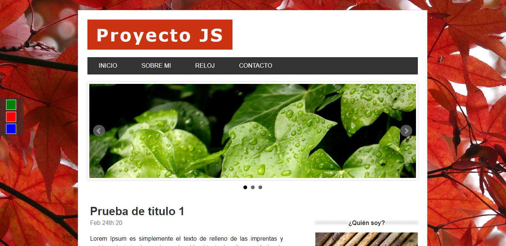
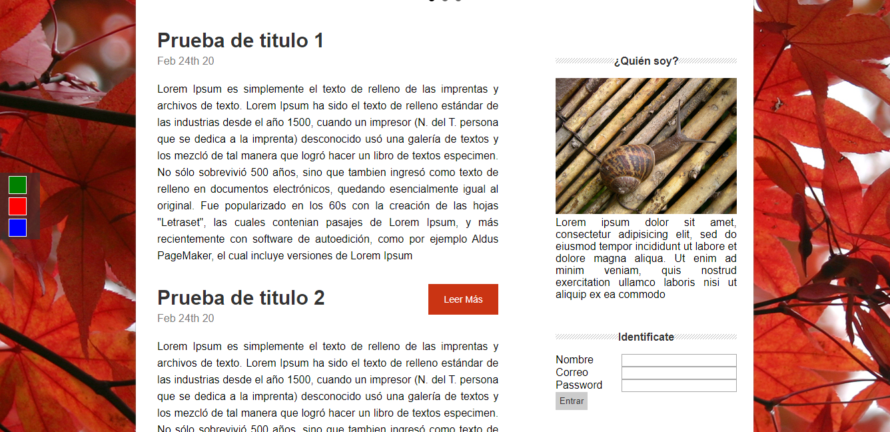

## Proyecto JS,

### Descripción
Pagina estatica sencilla con cambiador de temas, esta funcionalidad fue ejecutada implementando JavaScript vainilla
Otros componentes como el slideshow fueron ejecutados mediante librerias externas como Jquery por ejemplo, el CSS es puro, sin frameworks.

### Capturas de pantalla:

<!DOCTYPE html>
<html>

<body>
	<!-- Images -->
	
	
</body>
</html>

### Link del proyecto en Firebase: https://lhsite-1966d.web.app/index.html

